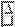

# libXaw3dXft: Athena Widgets + 3D + FreeType font support

## Overview

libXaw3dXft is an extension of
[libXaw3d](https://gitlab.freedesktop.org/xorg/lib/libxaw3d) that adds
[FreeType](https://gitlab.freedesktop.org/xorg/lib/libxft) font support.
libXaw3d, in turn, is an extension of
[libXaw](https://gitlab.freedesktop.org/xorg/lib/libxaw) that adds 3D relief
visual effects.  libXaw is X.Org's Athena toolkit, a.k.a. Athena Widgets, the
venerable X11 GUI framework that has provided the most stability over the
years.

To link with libXaw3dXft, an application using the GNU autotools build system
would include this in configure.ac:

    PKG_CHECK_MODULES(XAW3DXFT, [libxaw3dxft])

And this in Makefile.am:

    AM_CFLAGS  = $(XAW3DXFT_CFLAGS)
    AM_LDFLAGS = $(XAW3DXFT_LIBS)

## Building a release

    ./configure --enable-internationalization --enable-multiplane-bitmaps --enable-gray-stipples --enable-arrow-scrollbars
    make -j 4
    make install

See the INSTALL file for general help on using configure.

## Building git sources

First,

    autoreconf --install

Then proceed as for building a release.


## Configure options

### --enable-internationalization (default enabled)

Enables/disables internationalization features as used with Athena widgets
(locales, wide characters, UTF-8 strings, font sets, input/output methods).
Much of the affected code is bypassed when FreeType fonts are used, but there
is no reason to disable this.

### --enable-multiplane-bitmaps (default disabled)

Enables/disables XPM support and the library dependency on libXpm.  When
enabled, you may specify either XPM or XBM files for any bitmap resource,
whether by resource files, with editres, programmatically, etc.  When
disabled, the Xaw historical limitation to use only XBM remains.

In a future release, this will be enabled by default.

### --enable-arrow-scrollbars (default disabled)

Does just what it says.  See pics.  The Scrollbar widget's translations and
actions change accordingly.

Enabled:  

Disabled:  

In a future release, this will be enabled by default.

### --enable-gray-stipples (default disabled)

This affects the behavior only when the beNiceToColormap resource is true,
which means that libXaw3dXft allocates fewer colors to conserve slots in a
256- or 16-color palette for displays that don't support true color.
--enable-gray-stipples makes libXaw3dXft allocate a gray colorcell and use it
in stippled shadows when 1) widgets have black or white backgrounds and 2)
the beNiceToColormap resource is true and 3) the display allows it.

Indexed color (non-true-color) modes are relevant for historical or
retrocomputing purposes only.  Everyone else should always set the
beNiceToColormap resource to false.

Enabled:  

Disabled:  


## The widgets

Please refer to [Xaw
documentation](https://www.x.org/releases/X11R7.7/doc/libXaw/libXaw.html) and
the [Xaw3d
README](https://gitlab.freedesktop.org/xorg/lib/libxaw3d/-/blob/master/src/README.XAW3D).


## X resources

The X resources to which each widget responds include those that are
[documented for
Xaw](https://www.x.org/releases/X11R7.7/doc/libXaw/libXaw.html), some that
are mentioned by Xaw3d [examples](Xresources) and
[README](https://gitlab.freedesktop.org/xorg/lib/libxaw3d/-/blob/master/src/README.XAW3D),
and some that, alas, remain undocumented (use the source).

I strongly advise setting

```
*beNiceToColormap: False
```

in an .Xresources file, or, via the API:

```
XtVaSetValues (w, (char*)XtNbeNiceToColormap, (XtArgVal)False, NULL);
```


## Run-time options

The behaviors that are unique to Xaw3dXft rather than inherited from Xaw3d or
Xaw must be enabled by the app at run time.  An app gets access to the
Xaw3dXft control structure by doing

    #include <X11/Xaw3dxft/Xaw3dXft.h>
    Xaw3dXftData *xaw3dxft_data = NULL;
    GET_XAW3DXFT_DATA(xaw3dxft_data);

Then, the FreeType features are activated by setting encoding to something
other than 0:

```
xaw3dxft_data->encoding = -1; // UTF-8
```

The Xaw3dXftData struct contains the following fields with the default values
indicated.

### char encoding = 0

This field serves the dual function of activating FreeType and specifying
the character encoding.

| Value | Meaning |
| :---:  | --- |
|    0  | FreeType off; act like Xaw3d |
|   -1  | UTF-8 |
|    8  | 8-bit characters (Latin-1) |
|   16  | 16-bit characters (UCS-2?) |

### char * default_fontname = NULL

Applicable when:  default_font == NULL

The name of the font to be used when no font is specified by the app in a
particular context.  If this field is null, the compiled-in default is
Liberation-9.

### XftFont * default_font = NULL

The font to be used when no font is specified by the app in a particular
context.  If this field is null, the font named by default_fontname is loaded
and stored here for reuse.

### char multi_column_menu = 0

Applicable when:  no_hilit_reverse == 1

Determines the behavior of a menu when it doesn't fit on the screen in a
single column.  1 = multiple columns; 0 = single column with scroll arrows.

Multi-column menus are disabled if the widget cannot change size or if
no_hilit_reverse is 0.  The latter restriction is due to the 3D effect for
menu item mouseover not being implemented for multiple columns.

### char no_hilit_reverse = 0

The context-dependent effects of this confusing variable are shown in the
following table.

encoding | no_hilit_reverse | List item click | Menu item mouseover
:---: | :---: | :--- | :---
0         | 0 | Reverse fg/bg colors       | 3D effect
0         | 1 | fg = bg; bg ^= hilit_color | Reverse fg/bg colors
-1, 8, 16 | 0 | Black outline              | 3D effect
-1, 8, 16 | 1 | bg ^= hilit_color          | fg and bg ^= hilit_color

### char * hilit_color = NULL

Applicable when:  no_hilit_reverse == 1

Bitwise XOR value used to highlight list or menu items.  The string is passed
to XAllocNamedColor, and the red, green, and blue fields of the resulting
XColor are XORed with the respective fields of the color.  If hilit_color is
null on first use, the value "#000000" is assigned, so no highlighting
occurs.

### char text_bg_hilight = 0

Applicable when:  encoding != 0

1 = highlight selected text in text fields using text_bg_hilight_color; 0 =
do not highlight selected text at all.

When encoding is 0, selected text is shown with reversed fg/bg colors.

### Pixel text_bg_hilight_color = -1

Applicable when:  encoding != 0 && text_bg_hilight == 1

Bitwise XOR value applied to background colors to highlight selected text.
The Pixel is interpreted as a 3-byte value, one byte per color:  0xRRGGBB.
If left on the default value of -1, no highlighting occurs.

### char button_inverse = 1

Applicable when:  encoding == 0

Controls the color changing behavior when a Command button is pressed.  1 =
reverse fg/bg colors; 0 = the label text vanishes (possibly a bug).

When encoding != 0, there is no color changing behavior.

The button press is always indicated with a 3D effect in addition to any
color change that occurs.

### char button_dashed = 0

When the mouse cursor is over a button, a line is drawn around the button's
border.  1 = dashed line; 0 = solid line.  When encoding != 0, the border
line may be overlapped by text and as a result appear only as bars on the
left and right sides (bug).

### unsigned short insensitive_twist[4] = {0, 0, 0, 0}

Applicable when:  encoding != 0

Used to change the foreground color of the labels on "insensitive" widgets
(see XtSetSensitive) to make it visually apparent that they aren't accepting
mouse clicks or key presses.

Element 0 is a control flag; elements 1–3 are 16-bit values applied to red,
green, and blue respectively or only to alpha.

It is intended that this compound value should be set up using the
convenience function Xaw3dXftSetInsensitiveTwist(char *value), which is
provided by a function pointer in [proc](#proc) and also declared in
Xaw3dXftP.h.

The following table shows the form of character string input to
Xaw3dXftSetInsensitiveTwist and the corresponding control values in
insensitive_twist.  RR, GG, BB, and AA indicate bytes in hexadecimal.

char *value | insensitive_twist[0] | Function
:---: | :---: | :---:
"#RRGGBB"  | 0 | Assign value to color
"\|RRGGBB" | 1 | Bitwise OR with color
"&RRGGBB"  | 2 | Bitwise AND with color
"^RRGGBB"  | 3 | Bitwise XOR with color
"~AA"      | 4 | Assign value to alpha

The default value therefore has the effect of setting the text color on
insensitive widgets to black.

If encoding is 0, the text on insensitive widgets is stippled (grayed out)
and insensitive_twist has no effect.

### char menu_spacing = 1

The vertical pitch of menu items is padded by this number of pixels.
Tip labels are padded by triple this length.
0 is a perfectly good value.

### char show_tips = 1

Globally enable/disable showing tips.

### char tip_do_grab = 1

Grab or don't grab while showing a tip.

### Pixel tip_background_color = -1

Background color of tips.  If -1, the default background color is left as-is.

### char border_hack = 1

Work around composition/Xft related bug with the drawing of borders on some X
servers.  Whether this is still relevant is yet to be determined.

### char edit_delete_alternative = 0

Determines what happens when Delete or another key is pressed while editable
text is selected.

Value | Delete action | Other key action
:---: | :---: | :---:
0 | Backward delete 1 char | Insert char
1 | Delete selected text | Insert char
2 | Delete selected text | Replace selected text with char

### char text_sb_right = 0

1 = put the scrollbar on the right side of Text widgets; 0 = put it on
the left.

### Xaw3dXftProc * <a name="proc">proc</a> = ...

The Xaw3dXftProc struct contains pointers to [in]convenience functions.
These functions are also declared directly in Xaw3dXftP.h.

Xaw3dXftProc | Xaw3dXftP.h | Function
:--- | :--- | :---
set_default_hilit_color | Xaw3dXftSetDefaultHilitColor | hilit_color = strdup("#000000")
set_hilit_color         | Xaw3dXftSetHilitColor        | hilit_color = strdup(value) (after freeing any previous value)
set_default_fontname    | Xaw3dXftSetDefaultFontName   | default_fontname = strdup(value) (after freeing any previous value)
set_insensitive_twist   | Xaw3dXftSetInsensitiveTwist  | See insensitive_twist
get_font                | Xaw3dXftGetFont              | Return XftFont *
text_width              | Xaw3dXftTextWidth            | Return x-extent of string
draw_string             | Xaw3dXftDrawString           | Draw string on widget
#ifdef XAW_ARROW_SCROLLBARS | |
get_scrollbar           | Xaw3dXftGetScrollbar         | Return vertical scrollbar of AsciiText/Text widget
handle_mousewheel       | Xaw3dXftHandleMouseWheel     | Scrollbar handler for mouse wheel events
set_mousewheel_handler  | Xaw3dXftSetMouseWheelHandler | Add Xaw3dXftHandleMouseWheel as event handler
set_mousewheel_steps    | Xaw3dXftSetMouseWheelSteps   | scroll_steps = value
#endif | |


## Non-options

Messing with the following fields of xaw3dxft_data will cause glitchy
misbehavior.

### char string_use_pixmap = 0

When writing strings with the Xft library, 1 = use a pixmap, 0 = write
directly.  This was a workaround for some historical flickering problem.
Enabling it now introduces glitches that make buttons and menus look worse.

### char string_hilight = 0

Internal state of libXaw3dXft that should not have been exposed to
applications.

### Pixel text_fg_alternate_color = -1

Internal state of libXaw3dXft that should not have been exposed to
applications.

The colorSwitch resource of the List widget can be set to a function
pointer of type void (\*SwitchColorFunc) (Widget w, int n, int x, int y, Pixel
\*p).  If such a function is provided, it is called with
&text_fg_alternate_color as the last argument.  Any value placed in
text_fg_alternate_color is used in Xaw3dXftDrawString and then reset to -1.
If encoding is 0, it has no effect.


## History

Kaleb Keithley originated libXaw3d in 1992 as a general replacement for the
[Athena Widgets (Xaw)](https://gitlab.freedesktop.org/xorg/lib/libxaw) of
X11.  libXaw3d 1.5, released 1998-05-14, was "based on the R6.1/R6.3/R6.4
Athena Widget set."

D. J. Hawkey Jr. took over as maintainer for libXaw3d 1.5E, released
2003-03-08.  "This release of Xaw3d is based on X.Org's X11R6.3 Athena
toolkit, with bits and pieces thrown in from other sources."  "There were no
public releases of 1.5A through 1.5D."

[X.Org took over maintenance for libXaw3d
1.6](https://gitlab.freedesktop.org/xorg/lib/libxaw3d), released 2012-01-21.
At that point, libXaw3d was effectively forked from libXaw R6.3 (ish).

Meanwhile, [Jean-Pierre Demailly originated
libXaw3dXft](https://sourceforge.net/projects/sf-xpaint/files/libxaw3dxft/)
in 2009-09 as a general replacement for libXaw3d.  libXaw3dXft 1.6.2,
released 2012-03-04, was based on a 2012-02-29 libXaw3d development snapshot.
The remaining changes from the final libXaw3d 1.6.2 release were merged in
libXaw3dXft 1.6.2b, released 2013-01-26.  At that point, libXaw3dXft was
effectively forked from libXaw3d.

Jean-Pierre Demailly released libXaw3dXft-1.6.2h on 2020-07-02.  [He passed
away on 2022-03-17](https://en.wikipedia.org/wiki/Jean-Pierre_Demailly).

[Dave Flater took over maintenance of
libXaw3dXft](https://github.com/DaveFlater/libXaw3dXft) on 2025-02-16.  The
previous [SourceForge
repo](https://sourceforge.net/projects/sf-xpaint/files/libxaw3dxft/), which
has libXaw3dXft as a subdirectory of the XPaint project, appears to be
[abandoned and
unrecoverable](https://sourceforge.net/p/forge/documentation/Abandoned%20Projects/).
The new repo is at
[https://github.com/DaveFlater/libXaw3dXft](https://github.com/DaveFlater/libXaw3dXft).

## To do

For planned changes see the [Issues tab](https://github.com/DaveFlater/libXaw3dXft/issues) of the GitHub repo.
