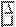

# libXaw3dXft: Athena Widgets + 3D + FreeType font support


- [Overview](#overview)
- [Building a release](#building)
- [Building git sources](#gitsrc)
- [Configure options](#configopt)
- [Linking with libXaw3dXft](#linking)
- [Version identification](#version)
- [Old documentation](#olddocs)
- [Classes not present in Athena Widgets](#newclasses)
- [Alterations to Athena Widgets classes](#alterations)
- [Run-time options](#runtimeopts)
- [Non-options](#nonoptions)
- [Version 1.x to 2.0 migration](#migration)
- [History](#history)
- [To do](#todo)


## <a name="overview"> Overview

libXaw3dXft is an extension of
[libXaw3d](https://gitlab.freedesktop.org/xorg/lib/libxaw3d) that adds
[FreeType](https://gitlab.freedesktop.org/xorg/lib/libxft) font support.
libXaw3d, in turn, is an extension of
[libXaw](https://gitlab.freedesktop.org/xorg/lib/libxaw) that adds 3D relief
visual effects.  libXaw is X.Org's Athena toolkit, a.k.a. Athena Widgets, the
venerable X11 GUI framework that has provided the most stability over the
years.  The contents of libXaw3dXft, libXaw3d, and libXaw may be referred to
as Xaw3dXft, Xaw3d, and Xaw, respectively.


## <a name="building"> Building a release

    ./configure
    make -j 4
    make install

See the INSTALL file for general help on using configure.


## <a name="gitsrc"> Building git sources

First,

    autoreconf --install

Then proceed as for building a release.


## <a name="configopt"> Configure options

Effective in version 2.0, all four of these options are enabled by default.
For version 1.6.4 and prior versions, only internationalization was enabled
by default.

### --enable-internationalization

Enables/disables internationalization features as used with Athena widgets
(locales, wide characters, UTF-8 strings, font sets, input/output methods).
Much of the affected code is bypassed when FreeType fonts are used, but there
is no reason to disable this.

### --enable-multiplane-bitmaps

Enables/disables XPM support and the library dependency on libXpm.  When
enabled, you may specify either XPM or XBM files for any bitmap resource,
whether by resource files, with editres, programmatically, etc.  When
disabled, the Xaw historical limitation to use only XBM remains.

### --enable-arrow-scrollbars

Does just what it says.  See pics.  The Scrollbar widget's translations and
actions change accordingly.

Enabled:  

Disabled:  

### --enable-gray-stipples

This option affects the rendering of stippled 3D shadows.  See the
explanation under the [ThreeD widget](#threed) about stippled versus solid
color shadows.

--enable-gray-stipples makes libXaw3dXft allocate a gray colorcell and use it
in stippled shadows when widgets have black or white backgrounds and the
display allows it.  This improves the appearance of stippled shadows at the
cost of using up another slot in the colormap.

Enabled:  

Disabled:  


## <a name="linking"> Linking with libXaw3dXft

To link with libXaw3dXft, an application using the GNU autotools build system
would include this in configure.ac:

    PKG_CHECK_MODULES(XAW3DXFT, [xaw3dxft])

And this in Makefile.am:

    AM_CFLAGS = $(XAW3DXFT_CFLAGS)
    LDADD     = $(XAW3DXFT_LIBS)


## <a name="version"> Version identification

Starting with version 2.0, libXaw3dXft implements
[libversiontemplate](https://github.com/DaveFlater/libversiontemplate) to
expose its semantic version number at configuration, preprocessing, compile,
link, and run times.

The pkg-config file xaw3dxft.pc supplies a version number that can be used by
the PKG_CHECK_MODULES macro in configure.ac; e.g.,
`PKG_CHECK_MODULES(XAW3DXFT, [xaw3dxft = 2])`.

The header file Xaw3dXft.h defines preprocessor macros and declares
constants:

    #define LIBXAW3DXFT_VERSION_MAJOR 2
    #define LIBXAW3DXFT_VERSION_MINOR 0
    #define LIBXAW3DXFT_VERSION_PATCH 0
    #define LIBXAW3DXFT_VERSION       2.0.0
    #define LIBXAW3DXFT_VERSION_STR   "2.0.0"

    extern const uint16_t libXaw3dXft_version_major,
                          libXaw3dXft_version_minor,
                          libXaw3dXft_version_patch;
    extern const char     libXaw3dXft_version[];

The built library libXaw3dxft.a or libXaw3dxft.so provides some linkable
functions that can be used by the AC_CHECK_LIB macro in configure.ac:

    void libXaw3dXft_version_major_2 () {}
    void libXaw3dXft_version_minor_0 () {}
    void libXaw3dXft_version_patch_0 () {}

Finally, the built library provides a grep-friendly version string that can
be retrieved from the command line:

    bash$ strings libXaw3dxft.so | grep -F 'libXaw3dXft version'
    libXaw3dXft version 2.0.0

Versions 1.3.3 through 1.6.4 exposed the version number only in the
pkg-config file, which was then called libxaw3dxft.pc rather than
xaw3dxft.pc.


## <a name="olddocs"> Old documentation

The following old documentation is provided under the [Docs_old
subdirectory](Docs_old) to fill in the gaps left by this README:

- [Athena Widget Set—C Language Inteface](Docs_old/Xaw_R6.3), X Version 11,
  Release 6.3.  This is the full documentation for the version of Xaw from
  which Xaw3d and Xaw3dXft were mostly forked.
- [READMEs](Docs_old/READMEs) from relevant old versions of Xaw3d and
  Xaw3dXft.  While not as thorough as the Xaw documentation, these READMEs
  summarize the changes that were made in the respective forks.  Beware that
  some details are no longer accurate for the current incarnation of Xaw3dXft.
- A conference paper, presentation, and code examples for the [Layout
  widget](Docs_old/Layout) by Keith Packard.  The code examples need updating
  to build with a current-generation compiler, but they are the only ones
  available for now.

Also relevant but not included here is the documentation of the [X Toolkit
Intrinsics
(Xt)](https://xorg.freedesktop.org/archive/X11R7.7/doc/libXt/intrinsics.html)
upon which Xaw is built.  The Core, Composite, Constraint, Shell, Object, and
Rectangle classes all come from Xt.

The following sections assume familiarity with Xaw R6.3 and Xt and
incorporate material from the Xaw3d and Xaw3dXft READMEs.


## <a name="newclasses"> Classes not present in Athena Widgets

### <a name="threed"> ThreeD

The ThreeD widget class does not exist in Xaw.  It is inherited by many other
widget classes to add 3D shadows to them.  Those widgets thus acquire the
resources of ThreeD in addition to those listed in the Xaw documentation.

ThreeD is inherited by Command, Grip, Label, MenuButton, Repeater, Scrollbar,
StripChart, and Toggle.  Command widgets receive the ThreeD shadowing
treatment only if their shapeStyle is set to XawShapeRectangle =
XmuShapeRectangle = 1.  SimpleMenu, Text, and Viewport each create and use a
ThreeD widget internally, but they do not inherit from the class.

ThreeD has the following public resources in addition to those that it
inherits from Core and Simple:

Name                 | Class                | RepType   | Default value
:---                 | :---                 | :---      | :---
shadowWidth          | ShadowWidth          | Dimension | 2
topShadowPixel       | TopShadowPixel       | Pixel     | dynamic
bottomShadowPixel    | BottomShadowPixel    | Pixel     | dynamic
topShadowContrast    | TopShadowContrast    | Int       | 20
bottomShadowContrast | BottomShadowContrast | Int       | 40
userData             | UserData             | XtPointer | NULL
beNiceToColormap     | BeNiceToColormap     | Boolean   | True
relief               | Relief               | XtRelief  | XtReliefRaised

3D shadows can be drawn either as solid colors or as a stippled pattern.
ThreeD decides which way to do it as follows:

1. If the visual depth is greater than 8 bits and the visual has an immutable
   colormap (i.e., the visual class is TrueColor, StaticColor, or
   StaticGray), always use solid colors.  (This condition was added in
   Xaw3dXft version 2.)
2. If the visual depth is 1 bit (monochrome, 2-color black and white), always
   stipple.
3. Otherwise, stipple if and only if the beNiceToColormap resource is true.

Shadows "grow outward" in the SimpleMenu and Text widgets, increasing these
widgets' sizes, "grow inward" in the Viewport and Scrollbar widgets,
decreasing the size of the clip widget and thumb, respectively, and "grow
inward" in the Label (and subclasses thereof) and SmeBSB widgets, encroaching
on their label parts.

The userData resource may be used by applications to store
application-specific data on a widget.  It is not touched by Xaw3dXft code.

XtRelief is an enum {XtReliefNone, XtReliefRaised, XtReliefSunken,
XtReliefRidge, and XtReliefGroove} defined in ThreeD.h; however, the Text,
SimpleMenu, Scrollbar, and Viewport widgets ignore this resource and display
only raised or sunken shadows.

The undeclared resources topShadowPixmap and bottomShadowPixmap appear to be
intended for internal use only.

### SmeThreeD

(Sme = simple menu entry; BSB = bitmap-string-bitmap style)

The SmeThreeD object class does not exist in Xaw.  It is a clone-and-hack of
ThreeD that is inherited only by SmeBSB.  It has the following public
resources in addition to those that it inherits from RectObj and Sme:

Name                 | Class                | RepType   | Default value
:---                 | :---                 | :---      | :---
shadowWidth          | ShadowWidth          | Dimension | 2
topShadowPixel       | TopShadowPixel       | Pixel     | dynamic
bottomShadowPixel    | BottomShadowPixel    | Pixel     | dynamic
topShadowContrast    | TopShadowContrast    | Int       | 20
bottomShadowContrast | BottomShadowContrast | Int       | 40
userData             | UserData             | XtPointer | NULL
beNiceToColormap     | BeNiceToColormap     | Boolean   | True

The 3D shadows on an SmeThreeD object appear only when the mouse is over it.
The outer shadow that is always present belongs to the menu.

Like ThreeD, SmeThreeD has undeclared resources topShadowPixmap and
bottomShadowPixmap that appear to be intended for internal use only.

### Tip

A Tip widget was added to Xaw in version R6.7.0, but the implementation in
Xaw3d and Xaw3dXft is not the same.  This XawTipEnable() function requires a
second parameter, to set the label:

    /* create a menu button */
    opsbutton = XtCreateManagedWidget("ops", menuButtonWidgetClass,
                                      parent, NULL, 0);

    /* add a tooltip */
    XawTipEnable(opsbutton, "Application functions");

    ...

    /* for some reason, disable the tooltip */
    XawTipDisable(opsbutton);

The labels of Tip widgets are set individually, but the font, colors,
margins, etc., can be set only globally, for all Tip widget instances.  For
example, a resource file might contain:

    *Tip.font:         7x13bold
    *Tip.background:   yellow
    *Tip.foreground:   blue
    *Tip.borderColor:  blue

The \*Margin resources of Xaw's Tip widget are not in this Tip widget; they
have been reduced to internalHeight and internalWidth resources, like those
of the Label widget.

Tip has the following resources in addition to those that it inherits from
Core:

Name           | Class        | RepType      | Default value
:---           | :----        | :---         | :---
backingStore   | BackingStore | BackingStore | Always + WhenMapped + NotUseful
encoding       | Encoding     | UnsignedChar | XawTextEncoding8bit
font           | Font         | XFontStruct* | XtDefaultFont
fontSet        | FontSet      | XFontSet     | XtDefaultFontSet
foreground     | Foreground   | Pixel        | XtDefaultForeground
internalHeight | Height       | Dimension    | 2
internalWidth  | Width        | Dimension    | 2
label          | Label        | String       | NULL
timeout        | Timeout      | Int          | 1200
xftFont        | XftFont      | String       | NULL

### Layout

The Layout widget class does not exist in Xaw.  It was created out-of-tree
by Keith Packard and apparently merged into Xaw3d but not Xaw.

The Layout widget is described as a hierarchical, constraint-based widget or
a TeX-style constraint widget class intended to improve the X Toolkit
geometry management process.  The specification of the layout is entirely
contained in the layout resource that is interpreted at run time.

The Xaw3d README states:  "The samples in Layout.h are wrong and don't work.
Example programs written by Keith Packard that use the Layout widget are
available at ftp://ftp.x.org/R5contrib/."  Those examples are provided
under [Docs_old/Layout](Docs_old/Layout) along with a conference paper
and presentation about the widget.

Layout has the following resources in addition to those that it inherits from
Core, Composite, and Constraint:

Name   | Class   | RepType | Default value
:---   | :---    | :---    | :---
debug  | Boolean | Boolean | False
layout | Layout  | Layout  | NULL


## <a name="alterations"> Alterations to Athena Widgets classes

Notable differences between the classes that exist in Xaw R6.3 and their
analogs in Xaw3dXft are detailed in the following subsections.

### Added FreeType font resources

Widgets that have font and fontSet resources in Xaw and Xaw3d (Label, List,
SmeBSB, Text \*, Tip, and their subclasses) get an additional resource in
Xaw3dXft:

Name    | Class   | RepType | Default value
:---    | :----   | :---    | :---
xftFont | XftFont | String  | NULL

\* Font resources for the complex of Text, AsciiText, TextSink, AsciiSink,
and MultiSink are split up among the classes.

If the FreeType features of Xaw3dXft have been activated by setting
xaw3dxft_data->encoding to something other than 0 (see [Run-time
options](#runtimeopts)), the font is determined by the xftFont resource.
Otherwise, if internationalization is enabled and active, the font is
determined by the fontSet resource.  Otherwise, the font is determined by the
font resource.

The usual syntax of the string value given to xftFont is the Xft font name
syntax described in [this
tutorial](https://keithp.com/~keithp/render/Xft.tutorial); e.g., "times-24"
for 24 point Times, "times:pixelsize=34" for 34 pixel Times, or
"times-24:foundry=adobe" to match Adobe Times only.  To use X Logical Font
Description (XLFD) syntax instead, prefix it with "core:"  e.g.,
"core:-adobe-times-medium-r-\*-\*-\*-240-\*-\*-\*-\*-\*-\*".  This change is
purely syntactic:  rendering is still done by FreeType using only the fonts
that are known to Fontconfig.

The default Xft font can be changed by calling Xaw3dXftSetDefaultFontName
(alias proc->set_default_fontname) before the first use or by directly
modifying the default_fontname and/or default_font fields of xaw3dxft_data
(see [Run-time options](#runtimeopts)).

If a named font fails to load, another font will be substituted without
warning.  🤷

### Label

The Label widget has some modifications ("bug fixes" \*) with respect to
geometry and positioning.  First, the internalHeight and internalWidth
resources are used to enforce a minimum size when the resize resource is
true.  Second, the Label widget and its subclasses respond "properly" to
changes in label parts and internal margins (subject to any constraints
placed on the widgets).

A Label widget will not resize shorter than its font even if its label is the
empty string.  Plain Xaw has no such inhibition.

\* The current maintainer finds the minimum size enforcement to be
inconsistent with the underlying model of Xaw:  "[Widgets] have little
control over issues such as their size or placement relative to other widget
peers.  Mechanisms are provided for associating geometric managers with
widgets and for widgets to make suggestions about their own geometry."  —
[Xaw R6.3 documentation](Docs_old/Xaw_R6.3/widgets.ps), §1.3

### <a name="listwidget"> List

Added resource:

Name        | Class       | RepType | Default value
:---        | :---        | :---    | :---
colorSwitch | ColorSwitch | Pointer | NULL

The colorSwitch resource of the List widget appeared in Xaw3dXft version
1.6.2c without documentation.  It can be set to a function pointer of type
void (\*SwitchColorFunc) (Widget w, int n, int x, int y, Pixel \*p).  If such
a function is provided, it is called with &text_fg_alternate_color as the
last argument.  If xaw3dxft_data->encoding is nonzero, any value placed in
text_fg_alternate_color is used in Xaw3dXftDrawString and then reset to -1.
If encoding is 0, the text_fg_alternate_color value is discarded and reset to
-1 with no effect.

### Scrollbar

Added resource:

Name    | Class   | RepType | Default value
:---    | :---    | :---    | :---
pickTop | PickTop | Boolean | False

The pickTop resource tweaks the interaction in which you grab the thumb of a
scrollbar.  When true, the thumb warps to the position where its top aligns
with the mouse pointer (like in Xaw).  When false, you can grab onto the
thumb anywhere along its length, and the act of grabbing it does not cause it
to move.

### SimpleMenu

Added resources:

Name            | Class                               | RepType | Default value
:---            | :---                                      | :---    | :---
leftWhitespace  | LeftWhitespace (or HorizontalWhitespace)  | Dimension | 0
rightWhitespace | RightWhitespace (or HorizontalWhitespace) | Dimension | 0
jumpScroll      | JumpScroll                                | Int       | 1

The use of these resources is explained in the following subsections.

#### Scrolling

The SimpleMenu widget supports scrolling through entries too numerous to fit
on the screen.  The resource jumpScroll determines the number of entries to
scroll by.

#### Margins

The leftWhitespace and rightWhitespace resources have been added to the
SimpleMenu widget for margin management.

The leftMargin resource can be different values in each SmeBSB widget, and
SimpleMenu will oblige.  If a pixmap wider than the margin is specified in
any SmeBSB widget, the result is less than desirable.  Set the leftWhitespace
resource in the parent SimpleMenu widget, and SimpleMenu will set all
children SmeBSB leftMargins to that value.  Specify a pixmap of any width for
any SmeBSB child, and SimpleMenu will separate the elements (menu edge,
pixmap, and text) of all SmeBSB children with that minimum distance as it
vertically aligns their text elements.

The SimpleMenu widget now resizes not only to the above, but also to changes
in these SmeBSB traits:  labels and fonts, pixmaps, and margins.

Implementation notes:  The SimpleMenu \*Whitespace resources override and
replace the values of SmeBSB \*Margin resources.  To nullify this behavior, a
\*Whitespace resource must first be set to zero, and the corresponding
\*Margin resources then set appropriately.  The \*Margin resources remain
unchanged in and of themselves; they behave just as always when the
\*Whitespace resources are not used.

#### <a name="submenus"> Sub-menus

The SimpleMenu and SmeBSB widgets have been extended to support sub-menus.
The new variables are simple_menu.sub_menu and simple_menu.state (neither are
public), and sme_bsb.menu_name, which is resourced as XtNmenuName, and
classed as XtCMenuName.  It's the latter resource that is used by an
application, and by default it is NULL; menus behave as they always have.
When this resource is set to a menu name, the parent SimpleMenu widget will
use the SmeBSB widget as the entry point to a child SimpleMenu widget,
managing its visibility and location.  No constraints are placed on focus or
the pointer.  Consider this code fragment:

    /* create a menu button */
    opsbutton = XtCreateManagedWidget("ops", menuButtonWidgetClass,
                                      parent, NULL, 0);

    /* create a menu for the button */
    opsmenu = XtCreatePopupShell("opsMenu", simpleMenuWidgetClass,
                                 opsbutton, NULL, 0);
    XtSetArg(args[0], XtNmenuName, "fileMenu");
    XtSetArg(args[1], XtNrightBitmap, rightArrow);
    filebutton = XtCreateManagedWidget("file", smeBSBObjectClass,
                                       opsmenu, args, 2);
    XtSetArg(args[0], XtNmenuName, "pageMenu");
    XtSetArg(args[1], XtNrightBitmap, rightArrow);
    pagebutton = XtCreateManagedWidget("page", smeBSBObjectClass,
                                       opsmenu, args, 2);
    quitbutton = XtCreateManagedWidget("quit", smeBSBObjectClass,
                                       opsmenu, NULL, 0);

    /* create a sub-menu for the first menu item */
    filemenu = XtCreatePopupShell("fileMenu", simpleMenuWidgetClass,
                                  opsmenu, NULL, 0);
    openbutton = XtCreateManagedWidget("open", smeBSBObjectClass,
                                       filemenu, NULL, 0);
    printbutton = XtCreateManagedWidget("print", smeBSBObjectClass,
                                        filemenu, NULL, 0);

    /* create a sub-menu for the second menu item */
    pagemenu = XtCreatePopupShell("pageMenu", simpleMenuWidgetClass,
                                  opsmenu, NULL, 0);
    prevbutton = XtCreateManagedWidget("prev", smeBSBObjectClass,
                                       pagemenu, NULL, 0);
    nextbutton = XtCreateManagedWidget("next", smeBSBObjectClass,
                                       pagemenu, NULL, 0);

The SimpleMenu widget named "opsMenu" will inherit the SimpleMenu widgets
named "fileMenu" and "pageMenu" as children sub-menus.  It will position the
first sub-menu next to the SmeBSB widget named "file", and the second next to
the SmeBSB widget named "page".  A sub-menu will be mapped (or unmapped) when
the pointer enters (or leaves) the superior SmeBSB widget.  Note that a
sub-menu's parent must be the superior SimpleMenu widget, not the superior
SmeBSB widget.  The other resources of SmeBSB widgets are unaffected by the
menuName resource.

### SmeBSB

Added resources:

Name      | Class     | RepType | Default value
:---      | :---      | :---    | :---
menuName  | MenuName  | String  | NULL
underline | Underline | Int     | -1

The resource menuName is used to specify the name of a sub-menu.  The use of
sub-menus was explained above under SimpleMenu [Sub-menus](#submenus).

The resource underline is used to specify a character to underline in the
label.  The integer value is the index of the character.  A value less than
zero or greater than or equal to the label length inhibits underlining.

### Viewport

Viewport has the following extra resources:

Name      | Class    | RepType  | Default value
:---      | :---     | :---     | :---
sbShiftX1 | Position | Position | 0
sbShiftX2 | Position | Position | 0
sbShiftY1 | Position | Position | 0
sbShiftY2 | Position | Position | 0

These are fudge factors for the positions and dimensions of the scrollbars.
They appeared in Xaw3dXft 1.3.1 without documentation and were probably used
for debugging.


## <a name="runtimeopts"> Run-time options

The behaviors that are unique to Xaw3dXft rather than inherited from Xaw3d or
Xaw must be enabled by the app at run time.  An app gets access to the
Xaw3dXft control structure by doing

    #include <X11/Xaw3dxft/Xaw3dXft.h>
    Xaw3dXftData *xaw3dxft_data = NULL;
    GET_XAW3DXFT_DATA(xaw3dxft_data);

Then, the FreeType features are activated by setting encoding to something
other than 0:

```
xaw3dxft_data->encoding = -1; // UTF-8
```

The Xaw3dXftData struct contains the following fields with the default values
indicated.

### char encoding = 0

This field serves the dual function of activating FreeType and specifying
the character encoding.

| Value | Meaning |
| :---: | --- |
|    0  | FreeType off; act like Xaw3d |
|   -1  | UTF-8 |
|    8  | 8-bit characters (Latin-1) |
|   16  | 16-bit characters (UCS-2?) |

### char * default_fontname = NULL

Applicable when:  default_font == NULL

The name of the font to be used when no font is specified by the app in a
particular context.  If this field is null, the compiled-in default is
Liberation-9.

### XftFont * default_font = NULL

The font to be used when no font is specified by the app in a particular
context.  If this field is null, the font named by default_fontname is loaded
and stored here for reuse.

### char multi_column_menu = 0

Applicable when:  no_hilit_reverse == 1

Determines the behavior of a menu when it doesn't fit on the screen in a
single column.  1 = multiple columns; 0 = single column with scroll arrows.

Multi-column menus are disabled if the widget cannot change size or if
no_hilit_reverse is 0.  The latter restriction is due to the 3D effect for
menu item mouseover not being implemented for multiple columns.

### char no_hilit_reverse = 0

The context-dependent effects of this confusing variable are shown in the
following table.

encoding | no_hilit_reverse | List item click | Menu item mouseover
:---: | :---: | :--- | :---
0         | 0 | Reverse fg/bg colors       | 3D effect
0         | 1 | fg = bg; bg ^= hilit_color | Reverse fg/bg colors
-1, 8, 16 | 0 | Black outline              | 3D effect
-1, 8, 16 | 1 | bg ^= hilit_color          | fg and bg ^= hilit_color

### char * hilit_color = NULL

Applicable when:  no_hilit_reverse == 1

Bitwise XOR value used to highlight list or menu items.  The string is passed
to XAllocNamedColor, and the red, green, and blue fields of the resulting
XColor are XORed with the respective fields of the color.  If hilit_color is
null on first use, the value "#000000" is assigned, so no highlighting
occurs.

### char text_bg_hilight = 0

Applicable when:  encoding != 0

1 = highlight selected text in text fields using text_bg_hilight_color; 0 =
do not highlight selected text at all.

When encoding is 0, selected text is shown with reversed fg/bg colors.

### Pixel text_bg_hilight_color = -1

Applicable when:  encoding != 0 && text_bg_hilight == 1

Bitwise XOR value applied to background colors to highlight selected text.
The Pixel is interpreted as a 3-byte value, one byte per color:  0xRRGGBB.
If left on the default value of -1, no highlighting occurs.

### char button_inverse = 1

Applicable when:  encoding == 0

Controls the color changing behavior when a Command button is pressed.  1 =
reverse fg/bg colors; 0 = the label text vanishes (possibly a bug).

When encoding != 0, there is no color changing behavior.

The button press is always indicated with a 3D effect in addition to any
color change that occurs.

### char button_dashed = 0

When the mouse cursor is over a button, a line is drawn around the button's
border.  1 = dashed line; 0 = solid line.  When encoding != 0, the border
line may be overlapped by text and as a result appear only as bars on the
left and right sides (bug).

### unsigned short insensitive_twist[4] = {0, 0, 0, 0}

Applicable when:  encoding != 0

Used to change the foreground color of the labels on "insensitive" widgets
(see XtSetSensitive) to make it visually apparent that they aren't accepting
mouse clicks or key presses.

Element 0 is a control flag; elements 1–3 are 16-bit values applied to red,
green, and blue respectively or only to alpha.

It is intended that this compound value should be set up using the
convenience function Xaw3dXftSetInsensitiveTwist(char *value), which is
provided by a function pointer in [proc](#proc) and also declared in
Xaw3dXftP.h.

The following table shows the form of character string input to
Xaw3dXftSetInsensitiveTwist and the corresponding control values in
insensitive_twist.  RR, GG, BB, and AA indicate bytes in hexadecimal.

char *value | insensitive_twist[0] | Function
:---: | :---: | :---:
"#RRGGBB"  | 0 | Assign value to color
"\|RRGGBB" | 1 | Bitwise OR with color
"&RRGGBB"  | 2 | Bitwise AND with color
"^RRGGBB"  | 3 | Bitwise XOR with color
"~AA"      | 4 | Assign value to alpha

The default value therefore has the effect of setting the text color on
insensitive widgets to black.

If encoding is 0, the text on insensitive widgets is stippled (grayed out)
and insensitive_twist has no effect.

### char menu_spacing = 1

The vertical pitch of menu items is padded by this number of pixels.
Tip labels are padded by triple this length.
0 is a perfectly good value.

### char show_tips = 1

Globally enable/disable showing tips.

### char tip_do_grab = 1

Grab or don't grab while showing a tip.

### Pixel tip_background_color = -1

Background color of tips.  If -1, the default background color is left as-is.

### char edit_delete_alternative = 0

Determines what happens when Delete or another key is pressed while editable
text is selected.

Value | Delete action | Other key action
:---: | :---: | :---:
0 | Backward delete 1 char | Insert char
1 | Delete selected text | Insert char
2 | Delete selected text | Replace selected text with char

### char text_sb_right = 0

1 = put the scrollbar on the right side of Text widgets; 0 = put it on
the left.

### Xaw3dXftProc * <a name="proc">proc</a> = ...

The Xaw3dXftProc struct contains pointers to [in]convenience functions.
These functions are also declared directly in Xaw3dXftP.h.

Xaw3dXftProc | Xaw3dXftP.h | Function
:--- | :--- | :---
set_default_hilit_color | Xaw3dXftSetDefaultHilitColor | hilit_color = strdup("#000000")
set_hilit_color         | Xaw3dXftSetHilitColor        | hilit_color = strdup(value) (after freeing any previous value)
set_default_fontname    | Xaw3dXftSetDefaultFontName   | default_fontname = strdup(value) (after freeing any previous value)
set_insensitive_twist   | Xaw3dXftSetInsensitiveTwist  | See insensitive_twist
get_font                | Xaw3dXftGetFont              | Return XftFont *
text_width              | Xaw3dXftTextWidth            | Return x-extent of string
draw_string             | Xaw3dXftDrawString           | Draw string on widget
#ifdef XAW_ARROW_SCROLLBARS | |
get_scrollbar           | Xaw3dXftGetScrollbar         | Return vertical scrollbar of AsciiText/Text widget
handle_mousewheel       | Xaw3dXftHandleMouseWheel     | Scrollbar handler for mouse wheel events
set_mousewheel_handler  | Xaw3dXftSetMouseWheelHandler | Add Xaw3dXftHandleMouseWheel as event handler
set_mousewheel_steps    | Xaw3dXftSetMouseWheelSteps   | scroll_steps = value
#endif | |


## <a name="nonoptions"> Non-options

Messing with the following fields of xaw3dxft_data will cause glitchy
misbehavior.

### char string_hilight = 0

Internal state of libXaw3dXft that should not have been exposed to
applications.

### Pixel text_fg_alternate_color = -1

Internal state of libXaw3dXft that should not have been exposed to
applications.  See the colorSwitch resource of the [List widget](#listwidget)
for its use.


## <a name="migration"> Version 1.x to 2.0 migration

Summary of backward-incompatible changes:

**Renamed pkg-config file to xaw3dxft.pc**

Dependents of libXaw3dXft that use pkg-config to find the library must look
for xaw3dxft where previously they looked for libxaw3dxft.  For example,
in configure.ac:

    PKG_CHECK_MODULES(XAW3DXFT, [xaw3dxft])

This renaming was for consistency with Xaw and Xaw3d, which use xaw7.pc and
xaw3d.pc respectively.

**Changed struct Xaw3dXftData**

border_hack:  deleted  
string_use_pixmap:  deleted

**Changed signatures of semi-private functions**

Xaw3dXftGetFont (alias proc->get_font):  replace display with object  
Xaw3dXftDrawString (alias proc->draw_string):  add visual

**Eliminated header include cycles**

Applications that include Text.h might now need to add includes for
TextSrc.h, TextSink.h, AsciiSrc.h, and/or AsciiSink.h, which are no longer
included by Text.h.

**Enabled all four configure options by default**

Dependents needing to build without libXpm now must configure with
--disable-multiplane-bitmaps or --enable-multiplane-bitmaps=no.


## <a name="history"> History

Kaleb Keithley originated libXaw3d in 1992 as a general replacement for the
[Athena Widgets (Xaw)](https://gitlab.freedesktop.org/xorg/lib/libxaw) of
X11.  libXaw3d 1.5, released 1998-05-14, was "based on the R6.1/R6.3/R6.4
Athena Widget set."

D. J. Hawkey Jr. took over as maintainer for libXaw3d 1.5E, released
2003-03-08.  "This release of Xaw3d is based on X.Org's X11R6.3 Athena
toolkit, with bits and pieces thrown in from other sources."  "There were no
public releases of 1.5A through 1.5D."

[X.Org took over maintenance for libXaw3d
1.6](https://gitlab.freedesktop.org/xorg/lib/libxaw3d), released 2012-01-21.
At that point, libXaw3d was effectively forked from libXaw R6.3 (ish).

Meanwhile, [Jean-Pierre Demailly originated
libXaw3dXft](https://sourceforge.net/projects/sf-xpaint/files/libxaw3dxft/)
in 2009-09 as a general replacement for libXaw3d.  libXaw3dXft 1.6.2,
released 2012-03-04, was based on a 2012-02-29 libXaw3d development snapshot.
The remaining changes from the final libXaw3d 1.6.2 release were merged in
libXaw3dXft 1.6.2b, released 2013-01-26.  At that point, libXaw3dXft was
effectively forked from libXaw3d.

Jean-Pierre Demailly released libXaw3dXft-1.6.2h on 2020-07-02.  [He passed
away on 2022-03-17](https://en.wikipedia.org/wiki/Jean-Pierre_Demailly).

[Dave Flater took over maintenance of
libXaw3dXft](https://github.com/DaveFlater/libXaw3dXft) on 2025-02-16.  The
previous [SourceForge
repo](https://sourceforge.net/projects/sf-xpaint/files/libxaw3dxft/), which
has libXaw3dXft as a subdirectory of the XPaint project, appears to be
[abandoned and
unrecoverable](https://sourceforge.net/p/forge/documentation/Abandoned%20Projects/).
The new repo is at
[https://github.com/DaveFlater/libXaw3dXft](https://github.com/DaveFlater/libXaw3dXft).


## <a name="todo"> To do

For planned changes, see the [Issues tab](https://github.com/DaveFlater/libXaw3dXft/issues) of the GitHub repo.

The second X is extra, but renaming the whole library at this point would
only exacerbate the problem of losing people in the transition.
