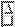

# libXaw3dXft: Athena Widgets + 3D + FreeType font support

🚨 libXaw3dXft is currently in the midst of a major revision.  Features that
previously worked through a global control structure are being transitioned
to use "normal" Xt widget resources.  Some widgets are using the new system
while some have not yet migrated.

- [Overview](#overview)
- [Building a release](#building)
- [Building git sources](#gitsrc)
- [Configure options](#configopt)
- [Linking with libXaw3dXft](#linking)
- [Version identification](#version)
- [Old documentation](#olddocs)
- [Generalities](#generalities)
- [Classes not present in Athena Widgets](#newclasses)
- [Alterations to Athena Widgets classes](#alterations)
- [Run-time options](#runtimeopts)
- [Version 1.x to 2.0 migration](#migration)
- [Rationale for features removed in 2.0](#rationale)
- [Oddities](#oddities)
- [History](#history)
- [To do](#todo)


## <a name="overview"> Overview

libXaw3dXft is an extension of
[libXaw3d](https://gitlab.freedesktop.org/xorg/lib/libxaw3d) that adds
[FreeType](https://gitlab.freedesktop.org/xorg/lib/libxft) font support.
libXaw3d, in turn, is an extension of
[libXaw](https://gitlab.freedesktop.org/xorg/lib/libxaw) that adds 3D relief
visual effects.  libXaw is X.Org's Athena toolkit, a.k.a. Athena Widgets, the
venerable X11 GUI framework that has provided the most stability over the
years.  The contents of libXaw3dXft, libXaw3d, and libXaw may be referred to
as Xaw3dXft, Xaw3d, and Xaw, respectively.


## <a name="building"> Building a release

    ./configure
    make -j 4
    make install

See the INSTALL file for general help on using configure.


## <a name="gitsrc"> Building git sources

First,

    autoreconf --install

Then proceed as for building a release.


## <a name="configopt"> Configure options

Effective in version 2.0, the three options below are enabled by default, and
the option to disable internationalization has been removed.  For version
1.6.4 and prior versions, only internationalization was enabled by default.

### --enable-multiplane-bitmaps

Enables/disables XPM support and the library dependency on libXpm.  When
enabled, you may specify either XPM or XBM files for any bitmap resource,
whether by resource files, with editres, programmatically, etc.  When
disabled, the Xaw historical limitation to use only XBM remains.

### --enable-arrow-scrollbars

Does just what it says.  See pics.  The Scrollbar widget's translations and
actions change accordingly.

Enabled:  

Disabled:  

### --enable-gray-stipples

This option affects the rendering of stippled 3D shadows.  See the
explanation under the [ThreeD widget](#threed) about stippled versus solid
color shadows.

--enable-gray-stipples makes libXaw3dXft allocate a gray colorcell and use it
in stippled shadows when widgets have black or white backgrounds and the
display allows it.  This improves the appearance of stippled shadows at the
cost of using up another slot in the colormap.

Enabled:  

Disabled:  


## <a name="linking"> Linking with libXaw3dXft

To link with libXaw3dXft, an application using the GNU autotools build system
would include this in configure.ac:

    PKG_CHECK_MODULES(XAW3DXFT, [xaw3dxft])

And this in Makefile.am:

    AM_CFLAGS = $(XAW3DXFT_CFLAGS)
    LDADD     = $(XAW3DXFT_LIBS)


## <a name="version"> Version identification

Starting with version 2.0, libXaw3dXft implements
[libversiontemplate](https://github.com/DaveFlater/libversiontemplate) to
expose its semantic version number at configuration, preprocessing, compile,
link, and run times.

The pkg-config file xaw3dxft.pc supplies a version number that can be used by
the PKG_CHECK_MODULES macro in configure.ac; e.g.,
`PKG_CHECK_MODULES(XAW3DXFT, [xaw3dxft = 2])`.

The header file Xaw3dXft.h defines preprocessor macros and declares
constants:

    #define LIBXAW3DXFT_VERSION_MAJOR 2
    #define LIBXAW3DXFT_VERSION_MINOR 0
    #define LIBXAW3DXFT_VERSION_PATCH 0
    #define LIBXAW3DXFT_VERSION       2.0.0
    #define LIBXAW3DXFT_VERSION_STR   "2.0.0"

    extern const uint16_t libXaw3dXft_version_major,
                          libXaw3dXft_version_minor,
                          libXaw3dXft_version_patch;
    extern const char     libXaw3dXft_version[];

The built library libXaw3dXft.a or libXaw3dXft.so provides some linkable
functions that can be used by the AC_CHECK_LIB macro in configure.ac:

    void libXaw3dXft_version_major_2 () {}
    void libXaw3dXft_version_minor_0 () {}
    void libXaw3dXft_version_patch_0 () {}

Finally, the built library provides a grep-friendly version string that can
be retrieved from the command line:

    bash$ strings libXaw3dXft.so | grep -F 'libXaw3dXft version'
    libXaw3dXft version 2.0.0

Versions 1.3.3 through 1.6.4 exposed the version number only in the
pkg-config file, which was then called libxaw3dxft.pc rather than
xaw3dxft.pc.


## <a name="olddocs"> Old documentation

The following old documentation is provided under the [Docs_old
subdirectory](Docs_old) to fill in the gaps left by this README:

- [Athena Widget Set—C Language Interface](Docs_old/Xaw_R6.3), X Version 11,
  Release 6.3.  This is the full documentation for the version of Xaw from
  which Xaw3d and Xaw3dXft were mostly forked.
- [READMEs](Docs_old/READMEs) from relevant old versions of Xaw3d and
  Xaw3dXft.  While not as thorough as the Xaw documentation, these READMEs
  summarize the changes that were made in the respective forks.  Beware that
  some details are no longer accurate for the current incarnation of Xaw3dXft.
- A conference paper, presentation, and code examples for the [Layout
  widget](Docs_old/Layout) by Keith Packard.  The code examples need updating
  to build with a current-generation compiler, but they are the only ones
  available for now.

Also relevant but not included here is the documentation of the [X Toolkit
Intrinsics
(Xt)](https://xorg.freedesktop.org/archive/X11R7.7/doc/libXt/intrinsics.html)
upon which Xaw is built.  The Core, Composite, Constraint, Shell, Object, and
Rectangle classes all come from Xt.

The following sections assume familiarity with Xaw R6.3 and Xt and
incorporate material from the Xaw3d and Xaw3dXft READMEs.


## <a name="generalities"> Generalities

### <a name="encodings"> Encodings

The encoding specifies how character strings are to be interpreted.  The
encodings understood by Xaw3dXft are enumerated in the Encoding.h header
file:

    typedef enum {
      XawTextEncoding8bit   = 0, // char, ISO-8859-1, Xlib STRING
      XawTextEncodingChar2b = 1, // XChar2b, UCS-2 big-endian [αβ]
      XawTextEncodingUTF8   = 2, // char, char8_t, FcChar8, UTF-8
      XawTextEncodingUCS2   = 3, // char16_t, FcChar16, UCS-2 [α]
      XawTextEncodingUTF32  = 4, // char32_t, FcChar32, UTF-32, UCS-4
      XawTextEncodingMb     = 5, // char, narrow multibyte, locale's codeset [γ]
      XawTextEncodingWc     = 6  // wchar_t, wide string [δ]
    } XawTextEncoding;

Notes:

\[α\] UCS-2 is the Unicode Basic Multilingual Plane as 16-bit values.
Microsoft encodes higher Unicode code points using surrogate pairs, which are
defined in UTF-16 but not in UCS-2.  Surrogate pairs are not supported by
Xaw3dXft.

\[β\] In the core X11 fonts system, the code points for XChar2b are
determined by the encoding of the *font* and the corresponding [.enc
file](https://xorg.freedesktop.org/archive/X11R7.7/doc/xorg-docs/fonts/fonts.html#The_fontenc_layer).
The assumption that XChar2b values are UCS-2 fails if the font uses a
non-Unicode, double-byte character set like JIS X 0208, KS C 5601, or GB
2312.  If such a font is used, Xaw3dXft may translate strings incorrectly.

\[γ\] The interpretation of narrow multibyte strings is determined by the
codeset from the [currently active C locale](#locales); e.g., UTF-8 from
en_US.UTF-8, ISO 8859-7 from el_GR.ISO8859-7, or ASCII from the default "C"
locale.

\[δ\] As of C23, everything about wide strings remains
[implementation-defined](https://www.open-std.org/jtc1/sc22/wg14/www/docs/n3366.htm),
and there is no reliable translation between wchar_t and UTF-anything.  A
[remedy](https://en.cppreference.com/c/header/stdmchar) is on track for C29
but is not yet implemented.  As a stopgap, Xaw3dXft relies on the
Unix-centric assumption that wchar_t is UTF-32.

### <a name="locales"> Locales

Locales matter to Xaw3dXft for two reasons:

- Narrow multibyte strings ("Mb" encoding) are interpreted according to the
  locale's codeset;
- Rendering using [font sets](#fontset) (described below) is limited to the
  character repertoire of the active locale regardless of the encoding used.

Every application starts in the default "C" locale, which allows only ASCII
characters.  To activate another locale, the application must call
[setlocale](https://en.cppreference.com/c/locale/setlocale).  It should also
call XSupportsLocale() to verify that X supports it and
XSetLocaleModifiers("") to initialize Xlib's state.

Rather than calling those functions directly, an application may use [Xt's
language
infrastructure](https://xorg.freedesktop.org/archive/X11R7.7/doc/libXt/intrinsics.html#Establishing_the_Locale).
If the application calls `XtSetLanguageProc(NULL, NULL, NULL)` before
XtToolkitInitialize(), Xt will automatically activate the locale specified by
(1) the -xnllanguage command line switch, (2) the xnlLanguage resource, or
(3) the LANG environment variable.

### <a name="fontsys"> Font systems

#### Original core X11 fonts system (plain old X fonts)

The standard set of core X11 fonts consists mainly of bitmap fonts available
in limited sizes and with limited character repertoires.  Newer fonts with
wide character repertoires can be used via the FreeType backend; however, the
rendering quality is limited by the core X11 fonts system.

Core fonts are identified using [X Logical Font
Description](https://xorg.freedesktop.org/archive/X11R7.7/doc/xorg-docs/xlfd/xlfd.html#FontName_Syntax)
(XLFD) syntax; for example:
`-adobe-courier-*-r-*-*-34-*-*-*-*-*-iso10646-1`.  The CHARSET_REGISTRY and
CHARSET_ENCODING fields should be set to `iso10646-1` (Unicode) as they are
in the preceding example whenever the font supports it.  If the registry is
left unspecified, e.g., `-adobe-courier-*-r-*-*-34-*-*-*-*-*-*-*`, the system
may select a limited character set such as `iso8859-1` (Latin-1), resulting in
a lot of characters being dropped needlessly.

When a plain old X font is used, Xaw3dXft calls the Xlib function XDrawString
or XDrawString16 to render text.  XDrawString and XDrawString16 are fixed on
the 8bit and Char2b encodings respectively.  If another encoding is provided,
Xaw3dXft translates it to Char2b, and characters outside of the [Basic
Multilingual
Plane](https://en.wikipedia.org/wiki/Plane_(Unicode)#Basic_Multilingual_Plane)
are replaced with ?.

#### <a name="fontset"> X font sets

An X font set is basically an ordered list of plain old X fonts that allows a
wide character repertoire to be cobbled together from several fonts that
support different pieces of it.  The rendering is done by the same core X11
fonts system.

When building a font set, it is better to leave CHARSET_REGISTRY and
CHARSET_ENCODING unspecified, as in the example
`-adobe-courier-*-r-*-*-34-*-*-*-*-*-*-*`, because the system will then
attempt to load every charset that it needs for the locale.

When a font set is used, Xaw3dXft calls the Xlib function XmbDrawString or
XwcDrawString to render text.  The latter function, unfortunately, converts
the input to Mb; thus, *all rendering using font sets is limited to the
character repertoire of the locale*.  Characters that do not exist in the
locale's codeset are silently dropped.  For best results, [set a UTF-8
locale](#locales).

If 8bit, Char2b, UCS-2, UTF-8, or UTF-32 is provided, Xaw3dXft translates it
to Wc, which is then reduced to Mb by Xlib.

While attractive in principle, the implementation of font sets left much to
be desired.  The process of choosing a font for a particular character goes
through an arbitrary encoding assignment that results in a lot of characters
being mistranslated or dropped unnecessarily (see [oddities](#fontsetfail)).
In the best case, it is difficult to assemble a set of fonts that do not
clash with one another's style or metrics.

#### <a name="freetype"> FreeType

FreeType is an improved font rendering system that circumvents the
limitations of the original core X11 fonts system.  Newer fonts can be scaled
and rendered at higher quality, and anti-aliasing is supported.

The Xft font name syntax is described in [this
tutorial](https://keithp.com/~keithp/render/Xft.tutorial); e.g., `times-24`
for 24 point Times, `times:pixelsize=34` for 34 pixel Times, or
`times-24:foundry=adobe` to match Adobe Times only.  Xft point sizes are
adjusted by the display scaling factors of desktop environments like KDE and
Gnome.  For example, if your display scaling factor is set to 175%, a
14-point font rendered by FreeType will be close in size to a 24-point font
rendered by the core fonts system.

libXft supports the 8bit, UTF-8, UCS-2, and UTF-32 encodings.  If Char2b is
provided, Xaw3dXft translates it to UCS-2.  If any other encoding is
provided, Xaw3dXft translates it to UTF-32.

### <a name="resources"> Resources

A widget accepting text (e.g., Label or its subclasses) will offer the
following resources related to fonts and encodings:

Name          | Class         | RepType      | Default value
:---          | :----         | :---         | :---
encoding      | Encoding      | UnsignedChar | XawTextEncoding8bit (XawTextEncodingMb if international)
font          | Font          | XFontStruct\* | XtDefaultFont
fontSet       | FontSet       | XFontSet     | XtDefaultFontSet
international | International | Boolean      | False
xftFont       | XftFont       | String       | NULL

The font system that Xaw3dXft will use to render the text is decided as
follows:

1. If xftFont is not null, use it (FreeType).
2. Else, if international is true, use fontSet.
3. Otherwise, use font (plain old X font).

The string value for xftFont is the font name.  Normally, it should be given
in the syntax described in the [previous section](#freetype), but to use XLFD
syntax instead, prefix it with "core:"  e.g.,
`core:-adobe-times-medium-r-*-*-*-240-*-*-*-*-iso10646-1`.  Note that this
change is purely syntactic:  rendering is still done by FreeType using only
the fonts that are known to Fontconfig.

If a named xftFont fails to load, another font will be substituted without
warning.  🤷

To make Xaw3dXft default to using 16 point Libertinus Serif font and UTF-8
encoding for everything, you would put the following in your .Xresources file
that is loaded by xrdb:

    *xftFont: Libertinus Serif-16
    *encoding: 2

(2 is the numeric value assigned to the enum XawTextEncodingUTF8 in
[Encoding.h](#encodings).)

To achieve the same global effect in application code, you could do this
right after opening the display:

    XrmDatabase database = XrmGetDatabase(display);
    XrmPutStringResource(&database, "*xftFont", "Libertinus Serif-16");
    unsigned char encoding = XawTextEncodingUTF8;
    XrmValue rmval = {sizeof(unsigned char), &encoding};
    XrmPutResource(&database, "*encoding", XtRUnsignedChar, &rmval);

Of course, the resources can also be set on an individual basis when widgets
are created using XtCreateManagedWidget or XtVaCreateManagedWidget.


## <a name="newclasses"> Classes not present in Athena Widgets

### <a name="threed"> ThreeD

The ThreeD widget class does not exist in Xaw.  It is inherited by many other
widget classes to add 3D shadows to them.  Those widgets thus acquire the
resources of ThreeD in addition to those listed in the Xaw documentation.

ThreeD is inherited by Command, Grip, Label, MenuButton, Repeater, Scrollbar,
StripChart, and Toggle.  Command widgets receive the ThreeD shadowing
treatment only if their shapeStyle is set to XawShapeRectangle =
XmuShapeRectangle = 1.  SimpleMenu, Text, and Viewport each create and use a
ThreeD widget internally, but they do not inherit from the class.

ThreeD has the following public resources in addition to those that it
inherits from Core and Simple:

Name                 | Class                | RepType   | Default value
:---                 | :---                 | :---      | :---
shadowWidth          | ShadowWidth          | Dimension | 2
topShadowPixel       | TopShadowPixel       | Pixel     | dynamic
bottomShadowPixel    | BottomShadowPixel    | Pixel     | dynamic
topShadowContrast    | TopShadowContrast    | Int       | 20
bottomShadowContrast | BottomShadowContrast | Int       | 40
userData             | UserData             | XtPointer | NULL
beNiceToColormap     | BeNiceToColormap     | Boolean   | True
relief               | Relief               | XtRelief  | XtReliefRaised

3D shadows can be drawn either as solid colors or as a stippled pattern.
ThreeD decides which way to do it as follows:

1. If the visual depth is greater than 8 bits and the visual has an immutable
   colormap (i.e., the visual class is TrueColor, StaticColor, or
   StaticGray), always use solid colors.  (This condition was added in
   Xaw3dXft version 2.)
2. If the visual depth is 1 bit (monochrome, 2-color black and white), always
   stipple.
3. Otherwise, stipple if and only if the beNiceToColormap resource is true.

The userData resource may be used by applications to store
application-specific data on a widget.  It is not touched by Xaw3dXft code.

XtRelief is an enum {XtReliefNone, XtReliefRaised, XtReliefSunken,
XtReliefRidge, and XtReliefGroove} defined in ThreeD.h; however, the Text,
SimpleMenu, Scrollbar, and Viewport widgets ignore this resource and display
only raised or sunken shadows.

The undeclared resources topShadowPixmap and bottomShadowPixmap appear to be
intended for internal use only.

### SmeThreeD

(Sme = simple menu entry; BSB = bitmap-string-bitmap style)

The SmeThreeD object class does not exist in Xaw.  It is a clone-and-hack of
ThreeD that is inherited only by SmeBSB.  It has the following public
resources in addition to those that it inherits from RectObj and Sme:

Name                 | Class                | RepType   | Default value
:---                 | :---                 | :---      | :---
shadowWidth          | ShadowWidth          | Dimension | 2
topShadowPixel       | TopShadowPixel       | Pixel     | dynamic
bottomShadowPixel    | BottomShadowPixel    | Pixel     | dynamic
topShadowContrast    | TopShadowContrast    | Int       | 20
bottomShadowContrast | BottomShadowContrast | Int       | 40
userData             | UserData             | XtPointer | NULL
beNiceToColormap     | BeNiceToColormap     | Boolean   | True

The 3D shadows on an SmeThreeD object appear only when the mouse is over it.
The outer shadow that is always present belongs to the menu.

Like ThreeD, SmeThreeD has undeclared resources topShadowPixmap and
bottomShadowPixmap that appear to be intended for internal use only.

### Tip

A Tip widget was added to Xaw in version R6.7.0, but the implementation in
Xaw3d and Xaw3dXft is not the same.  This XawTipEnable() function requires a
second parameter, to set the label:

    /* create a menu button */
    opsbutton = XtCreateManagedWidget("ops", menuButtonWidgetClass,
                                      parent, NULL, 0);

    /* add a tooltip */
    XawTipEnable(opsbutton, "Application functions");

    ...

    /* for some reason, disable the tooltip */
    XawTipDisable(opsbutton);

The labels of Tip widgets are set individually, but the font, colors,
margins, etc., can be set only globally, for all Tip widget instances.  For
example, a resource file might contain:

    *Tip.font:         7x13bold
    *Tip.background:   yellow
    *Tip.foreground:   blue
    *Tip.borderColor:  blue

The \*Margin resources of Xaw's Tip widget are not in this Tip widget; they
have been reduced to internalHeight and internalWidth resources, like those
of the Label widget.

Tip has the following resources in addition to those that it inherits from
Core:

Name           | Class        | RepType      | Default value
:---           | :----        | :---         | :---
backingStore   | BackingStore | BackingStore | Always + WhenMapped + NotUseful
encoding       | Encoding     | UnsignedChar | XawTextEncoding8bit (XawTextEncodingMb if international)
font           | Font         | XFontStruct* | XtDefaultFont
fontSet        | FontSet      | XFontSet     | XtDefaultFontSet
foreground     | Foreground   | Pixel        | XtDefaultForeground
internalHeight | Height       | Dimension    | 2
internalWidth  | Width        | Dimension    | 2
label          | Label        | String       | NULL
timeout        | Timeout      | Int          | 1200
xftFont        | XftFont      | String       | NULL

The border width of Tip widgets is permanently fixed at 0 to prevent a blurry
text glitch from affecting the pop-up window.

### Layout

The Layout widget class does not exist in Xaw.  It was created out-of-tree
by Keith Packard and apparently merged into Xaw3d but not Xaw.

The Layout widget is described as a hierarchical, constraint-based widget or
a TeX-style constraint widget class intended to improve the X Toolkit
geometry management process.  The specification of the layout is entirely
contained in the layout resource that is interpreted at run time.

The Xaw3d README states:  "The samples in Layout.h are wrong and don't work.
Example programs written by Keith Packard that use the Layout widget are
available at ftp://ftp.x.org/R5contrib/."  Those examples are provided
under [Docs_old/Layout](Docs_old/Layout) along with a conference paper
and presentation about the widget.

Layout has the following resources in addition to those that it inherits from
Core, Composite, and Constraint:

Name   | Class   | RepType | Default value
:---   | :---    | :---    | :---
debug  | Boolean | Boolean | False
layout | Layout  | Layout  | NULL


## <a name="alterations"> Alterations to Athena Widgets classes

Notable differences between the classes that exist in Xaw R6.3 and their
analogs in Xaw3dXft are detailed in the following subsections.

### AsciiSink, AsciiSrc, AsciiText

See [Text](#TextWidget).

### Command

Added resource:

Name    | Class   | RepType | Default value
:---    | :----   | :---    | :---
highlightDashed | Boolean | Boolean | False

When the mouse cursor is over a Command button, a line is drawn around the
inside of the button's border.  The highlightDashed resource controls the
line style used:  true = dashed line; false = solid line.  Width is specified
by the highlightThickness resource.

The highlight appears within the margin created by the internalHeight and
internalWidth resources inherited from Label.  If highlightThickness exceeds
internalHeight or internalWidth, the highlight and the label contents will
draw over one another.

Button presses are acknowledged with a color transformation that switches the
foreground and background colors.  It is applied via an exclusive-or function
of Pixel values.  The effect on pixmaps, including the background pixmap, is
colormap-dependent but generally sufficient to show contrast with the unset
state.

When a Command button's shape is changed from the default rectangle, Xaw3dXft
adjusts some dimensions automatically:

- Shadow width is changed to 0.  (Shadow drawing is implemented only for
  rectangles.)
- If border width is 0, it is set to 1.  (Without this, the shape would have
  no outline.)
- Highlight thickness is changed to 0 unless a value was explicitly set.
  (Highlights are cropped by the shape, so they might look odd or be
  invisible.)

### Label

Added resource:

Name    | Class   | RepType | Default value
:---    | :----   | :---    | :---
xftFont | XftFont | String  | NULL

Resources related to fonts, encodings, and text rendering are as described
under [Generalities](#generalities).  Multi-line text is allowed.

The default size of Label widgets (which includes subclasses like Command
buttons) has increased by 2×shadowWidth in both dimensions.

The Label widget has some other modifications ("bug fixes") with respect
to geometry and positioning.  First, the internalHeight and internalWidth
resources are used to enforce a minimum size when the resize resource is
true.  Second, the Label widget and its subclasses respond "properly" to
changes in label parts and internal margins (subject to any constraints
placed on the widgets).

As in Xaw, Label will use its core name as the label text if XtNlabel is not
supplied.  In this case, the encoding must be 8bit, UTF8, or mb because the
core name is handled by Xt as a regular C string.

### <a name="listwidget"> List

Added resources:

Name        | Class       | RepType | Default value
:---        | :---        | :---    | :---
encoding  | Encoding  | UnsignedChar | XawTextEncoding8bit (XawTextEncodingMb if international)
highlight | Background | Pixel | XtDefaultBackground
highlightStyle | ListHighlightStyle | UnsignedChar | ListHighlightReverse
xftFont | XftFont | String  | NULL

Resources related to fonts, encodings, and text rendering are as described
under [Generalities](#generalities).  Multi-line text is allowed.

The values of the highlightStyle resource are as follows:

    typedef enum {
      ListHighlightReverse=0,    // Reverse foreground and background colors
      ListHighlightBackground=1  // Paint background with highlight color
    } ListHighlightStyle;

The highlight resource gives the alternate background color that is used
when highlightStyle is ListHighlightBackground.

Reverse and background highlighting are applied via an exclusive-or function
of Pixel values.  Their effect on a background pixmap is colormap-dependent
but generally sufficient to show contrast with the unhighlighted state.

### MultiSink, MultiSrc

See [Text](#TextWidget).

### Repeater

The flash feature of the Repeater widget is disabled.  It does not work in
Xaw and it has no reasonable implementation that works on a modern X server.

### Scrollbar

Added resource:

Name    | Class   | RepType | Default value
:---    | :---    | :---    | :---
pickTop | PickTop | Boolean | False

The pickTop resource tweaks the interaction in which you grab the thumb of a
scrollbar.  When true, the thumb warps to the position where its top aligns
with the mouse pointer (like in Xaw).  When false, you can grab onto the
thumb anywhere along its length, and the act of grabbing it does not cause it
to move.

The Scrollbar widget does not adjust its size to accommodate 3D shadows.  The
shadows "grow inward" and crowd the scrollbar's contents.  To make room for
wider shadows, increase the thickness resource (default 14 pixels).

### SimpleMenu

The border width of SimpleMenu widgets is permanently fixed at 0 in Xaw3dXft
to prevent a blurry text glitch from affecting the pop-up window.  (The
glitch can be reproduced with Xaw.)

Added resources:

Name            | Class                               | RepType | Default value
:---            | :---                                      | :---    | :---
leftWhitespace  | LeftWhitespace (or HorizontalWhitespace)  | Dimension | 0
rightWhitespace | RightWhitespace (or HorizontalWhitespace) | Dimension | 0
jumpScroll      | JumpScroll                                | Int       | 1

The use of these resources is explained in the following subsections.

#### Scrolling

The SimpleMenu widget supports scrolling through entries too numerous to fit
on the screen.  The jumpScroll resource determines the number of entries to
scroll by.

#### Margins / whitespace

The leftWhitespace and rightWhitespace resources have been added to the
SimpleMenu widget for margin management.

Each SmeBSB menu item has leftMargin and rightMargin resources, both of which
default to 4 pixels.  SmeBSB by default sizes itself for the width of the
text label, plus those margins, plus the shadow widths.  It does not
automatically make room for the optional left or right bitmaps if they are
provided; it expects someone to increase the margins to make room for them.

If leftWhitespace or rightWhitespace is set to a nonzero value on the
SimpleMenu widget, SimpleMenu will set the corresponding margins of all
SmeBSB children as follows:

- If none of the children has a bitmap, set all of their margins to the
  whitespace value.
- Otherwise, set all of their margins to the width of the widest bitmap
  plus twice the whitespace value.

By default, leftWhitespace and rightWhitespace are both 0, and each SmeBSB
will be laid out according to its own leftMargin and rightMargin resources.

Space is allowed for 3D shadows to be used as a highlighting mechanism on
menu items.  Extra vertical space comes from the vertSpace resource (from
Xaw) and from xaw3dxft_data->menu_spacing.

#### <a name="submenus"> Sub-menus

Support for sub-menus was added to Xaw3d after its fork from Xaw.  Compatible
functionality was added to Xaw in X11R6.7, but it still is not mentioned in
the X11R7.7 Xaw documentation.

SmeBSB has a resource menuName that defaults to NULL.  When this resource is
set to a menu name, the parent SimpleMenu widget will use the SmeBSB widget
as the entry point to a child SimpleMenu widget, managing its visibility and
location.  No constraints are placed on focus or the pointer.  Consider this
code fragment:

    /* create a menu button */
    opsbutton = XtCreateManagedWidget("ops", menuButtonWidgetClass,
                                      parent, NULL, 0);

    /* create a menu for the button */
    opsmenu = XtCreatePopupShell("opsMenu", simpleMenuWidgetClass,
                                 opsbutton, NULL, 0);
    XtSetArg(args[0], XtNmenuName, "fileMenu");
    XtSetArg(args[1], XtNrightBitmap, rightArrow);
    filebutton = XtCreateManagedWidget("file", smeBSBObjectClass,
                                       opsmenu, args, 2);
    XtSetArg(args[0], XtNmenuName, "pageMenu");
    XtSetArg(args[1], XtNrightBitmap, rightArrow);
    pagebutton = XtCreateManagedWidget("page", smeBSBObjectClass,
                                       opsmenu, args, 2);
    quitbutton = XtCreateManagedWidget("quit", smeBSBObjectClass,
                                       opsmenu, NULL, 0);

    /* create a sub-menu for the first menu item */
    filemenu = XtCreatePopupShell("fileMenu", simpleMenuWidgetClass,
                                  opsmenu, NULL, 0);
    openbutton = XtCreateManagedWidget("open", smeBSBObjectClass,
                                       filemenu, NULL, 0);
    printbutton = XtCreateManagedWidget("print", smeBSBObjectClass,
                                        filemenu, NULL, 0);

    /* create a sub-menu for the second menu item */
    pagemenu = XtCreatePopupShell("pageMenu", simpleMenuWidgetClass,
                                  opsmenu, NULL, 0);
    prevbutton = XtCreateManagedWidget("prev", smeBSBObjectClass,
                                       pagemenu, NULL, 0);
    nextbutton = XtCreateManagedWidget("next", smeBSBObjectClass,
                                       pagemenu, NULL, 0);

The SimpleMenu widget named "opsMenu" will inherit the SimpleMenu widgets
named "fileMenu" and "pageMenu" as children sub-menus.  It will position the
first sub-menu next to the SmeBSB widget named "file", and the second next to
the SmeBSB widget named "page".  A sub-menu will be mapped (or unmapped) when
the pointer enters (or leaves) the superior SmeBSB widget.  Note that a
sub-menu's parent must be the superior SimpleMenu widget, not the superior
SmeBSB widget.

### SmeBSB

Added resources:

Name      | Class     | RepType | Default value
:---      | :---      | :---    | :---
encoding  | Encoding  | UnsignedChar | XawTextEncoding8bit (XawTextEncodingMb if international)
highlight | Background | Pixel | XtDefaultBackground
highlightStyle | MenuHighlightStyle | UnsignedChar | MenuHighlightReverse
menuName  | MenuName  | String  | NULL
underline | Underline | Int     | -1
xftFont | XftFont | String  | NULL

Resources related to fonts, encodings, and text rendering are as described
under [Generalities](#generalities).  Multi-line text is allowed.

The values of the highlightStyle resource are as follows:

    typedef enum {
      MenuHighlightReverse=0,    // Reverse foreground and background colors
      MenuHighlightBackground=1, // Paint background with highlight color
      MenuHighlightShadow=2      // Add shadows, do not change colors
    } MenuHighlightStyle;

The highlight resource gives the alternate background color that is used
when highlightStyle is MenuHighlightBackground.

Reverse and background highlighting are applied via an exclusive-or function
of Pixel values.  Their effect on pixmaps, including the background pixmap,
is colormap-dependent but generally sufficient to show contrast with the
unhighlighted state.

The menuName resource is used to specify the name of a sub-menu.  The use of
sub-menus was explained above under SimpleMenu [Sub-menus](#submenus).

The underline resource is used to specify a character to underline in the
label.  The integer value is the index of the character.  A value less than
zero inhibits underlining.

Being a non-widget Object, SmeBSB does not have a window of its own, so the
borderWidth resource that it inherits from Rectangle is inoperative.

### <a name="TextWidget"> Text

The Text widget and its associated objects and subclasses are a complex
assembly.  Among them, the only one that an application should create is
AsciiText.

Layers of legacy have resulted in an inconsistent naming convention for
"Ascii."  When it stands in contrast to "Multi," "Ascii" means specifically
8bit text.  Otherwise, it just means text.  The AsciiText widget is just
text; it accepts all encodings.

Added resources:

Name    | Class   | RepType | Default value
:---    | :----   | :---    | :---
encoding           | Encoding           | unsigned char | XawTextEncoding8bit (XawTextEncodingMb if international)
highlight          | Background         | Pixel         | XtDefaultBackground
highlightStyle     | TextHighlightStyle | unsigned char | TextHighlightReverse
xftFont            | XftFont            | String        | NULL

Resources related to fonts, encodings, and text rendering are as described
under [Generalities](#generalities).  Multi-line text is allowed.

The values of the highlightStyle resource are as follows:

    typedef enum {
      TextHighlightReverse=0,    // Reverse foreground and background colors
      TextHighlightBackground=1  // Paint background with highlight color
    } TextHighlightStyle;

The highlight resource gives the alternate background color that is used
when highlightStyle is TextHighlightBackground.

Reverse and background highlighting are applied via an exclusive-or function
of Pixel values.  Their effect on a background pixmap is colormap-dependent
but generally sufficient to show contrast with the unhighlighted state.

Quirks and differences to be aware of:

Xaw | Xaw3dXft
:-- | :---
The encoding of the string or the file is assumed to be Mb if international is true and 8bit otherwise. | The encoding resource specifies the encoding.
The class of the type resource is documented as Type but implemented as AsciiType and MultiType in AsciiSrc and MultiSrc respectively. | These definitions have been merged, and the class is TextType.
Setting useStringInPlace and international to True at the same time invokes broken code. | Setting useStringInPlace to True is allowed only when encoding is XawTextEncoding8bit and type is XawAsciiString.
TextSrc and TextSink are vacuous superclasses. | TextSrc and TextSink contain resources and code that are shared by their subclasses.
The encoding of a file inserted by the insert-file() action is assumed to be 8bit. | The encoding resource specifies the encoding.
The nominal character width used for setting tabs is (1) the FIGURE_WIDTH font property, if present, (2) the width of the '$' character, if present, or (3) max_bounds.width. | The nominal character width used for setting tabs is the width of the '$' character, if present, and otherwise whatever the font system returns for a missing character.

The length resource is misleading.  Its only function is to override
pieceSize when useStringInPlace is True so that the string can grow.

### Viewport

Viewport has the following extra resources:

Name      | Class    | RepType  | Default value
:---      | :---     | :---     | :---
sbShiftX1 | Position | Position | 0
sbShiftX2 | Position | Position | 0
sbShiftY1 | Position | Position | 0
sbShiftY2 | Position | Position | 0

These are fudge factors for the positions and dimensions of the scrollbars.
They appeared in Xaw3dXft 1.3.1 without documentation and were probably used
for debugging.


## <a name="runtimeopts"> Run-time options

🚨 This feature is going away.  Functions are being transferred from the
global struct to Xt resources.

The behaviors that are unique to Xaw3dXft rather than inherited from Xaw3d or
Xaw must be enabled by the app at run time.  An app gets access to the
Xaw3dXft control structure by doing

    #include <X11/Xaw3dXft/Xaw3dXft.h>
    Xaw3dXftData *xaw3dxft_data = NULL;
    GET_XAW3DXFT_DATA(xaw3dxft_data);

Then, the FreeType features are activated by setting encoding to something
other than 0:

```
xaw3dxft_data->encoding = -1; // UTF-8
```

The Xaw3dXftData struct contains the following fields with the default values
indicated.

### char encoding = 0

This field serves the dual function of activating FreeType and specifying
the character encoding.

| Value | Meaning |
| :---: | --- |
|    0  | FreeType off; act like Xaw3d |
|   -1  | UTF-8 |
|    8  | 8-bit characters (Latin-1) |
|   16  | 16-bit characters (UCS-2) |

### char * default_fontname = NULL

Applicable when:  default_font == NULL

The name of the font to be used when no font is specified by the app in a
particular context.  If this field is null, the compiled-in default is
Liberation-9.

### XftFont * default_font = NULL

The font to be used when no font is specified by the app in a particular
context.  If this field is null, the font named by default_fontname is loaded
and stored here for reuse.

### char multi_column_menu = 0

Applicable when:  a SimpleMenu is not realized or its allowShellResize
resource is true

Determines the behavior of a menu when it doesn't fit on the screen in a
single column.  1 = multiple columns; 0 = single column with scroll arrows.

### char show_tips = 1

Globally enable/disable showing tips.

### char tip_do_grab = 1

Grab or don't grab while showing a tip.

### char edit_delete_alternative = 0

Determines what happens when Delete or another key is pressed while editable
text is selected.

Value | Delete action | Other key action
:---: | :---: | :---:
0 | Backward delete 1 char | Insert char
1 | Delete selected text | Insert char
2 | Delete selected text | Replace selected text with char

### char text_sb_right = 0

1 = put the scrollbar on the right side of Text widgets; 0 = put it on
the left.

### Xaw3dXftProc * <a name="proc">proc</a> = ...

The Xaw3dXftProc struct contains pointers to [in]convenience functions.
These functions are also declared directly in Xaw3dXftP.h.

Xaw3dXftProc | Xaw3dXftP.h | Function
:--- | :--- | :---
set_default_fontname    | Xaw3dXftSetDefaultFontName   | default_fontname = strdup(value) (after freeing any previous value)
get_font                | Xaw3dXftGetFont              | Return XftFont *
text_width              | Xaw3dXftTextWidth            | Return x-extent of string
draw_string             | Xaw3dXftDrawString           | Draw string on widget
#ifdef XAW_ARROW_SCROLLBARS | |
get_scrollbar           | Xaw3dXftGetScrollbar         | Return vertical scrollbar of AsciiText/Text widget
handle_mousewheel       | Xaw3dXftHandleMouseWheel     | Scrollbar handler for mouse wheel events
set_mousewheel_handler  | Xaw3dXftSetMouseWheelHandler | Add Xaw3dXftHandleMouseWheel as event handler
set_mousewheel_steps    | Xaw3dXftSetMouseWheelSteps   | scroll_steps = value
#endif | |


## <a name="migration"> Version 1.x to 2.0 migration

Summary of backward-incompatible changes:

**Renamed pkg-config file to xaw3dxft.pc**

Dependents of libXaw3dXft that use pkg-config to find the library must look
for xaw3dxft where previously they looked for libxaw3dxft.  For example,
in configure.ac:

    PKG_CHECK_MODULES(XAW3DXFT, [xaw3dxft])

This renaming was for consistency with Xaw and Xaw3d, which use xaw7.pc and
xaw3d.pc respectively.

**Harmonized spelling to [lib]Xaw3dXft elsewhere**

- The library changes from libXaw3dxft to libXaw3dXft (.a, .so).
  Dependents using pkg-config will get this change automatically.  Others
  will need to modify their link lines.
- The include path changes from X11/Xaw3dxft to X11/Xaw3dXft.  An install
  hook creates a symbolic link from the old name.
- The docs move from share/doc/libxaw3dxft to share/doc/libXaw3dXft.

**Deleted the --enable-internationalization configure option**

It is now permanently enabled.

**Retired global struct Xaw3dXftData**

border_hack:  deleted (necessary workaround always on)  
button_dashed:  use Command.highlightDashed resource  
button_inverse:  deleted (button presses always get inverse)  
default_font, default_fontname:  use xftFont resource  
encoding:  use encoding resource  
hilit_color:  use highlight resource  
menu_spacing:  use SmeBSB.vertSpace resource  
no_hilit_reverse:  use highlightStyle resource  
insensitive_twist:  deleted (all insensitive widgets are stippled)  
string_use_pixmap:  deleted (workaround not needed anymore)  
text_bg_hilight:  use highlightStyle resource  
text_bg_hilight_color:  use highlight resource  
tip_background_color:  use Tip.background resource

**Changed signatures of semi-private functions**

Xaw3dXftGetFont (alias proc->get_font):  replace display with object  

**Changed default size of Label widgets**

The default size of Label widgets (which includes subclasses like Command
buttons) has increased by 2×shadowWidth in both dimensions.  The shadow
widths were previously unaccounted for, causing display glitches.

**Eliminated header include cycles**

Applications that include Text.h might now need to add includes for
TextSrc.h, TextSink.h, AsciiSrc.h, and/or AsciiSink.h, which are no longer
included by Text.h.

**Deleted colorSwitch**

The colorSwitch resource of the List widget was weird, undocumented, and of
no known use.


## <a name="rationale"> Rationale for features removed in 2.0

### no_hilit_reverse extra highlighting behaviors

In Xaw3dXft 1.x, the global variable no_hilit_reverse had the following
context-dependent effects on List and SmeBSB:

font system | no_hilit_reverse | List item click | Menu item mouseover
:---: | :---: | :--- | :---
core | 0 | Reverse fg/bg colors       | Shadows
core | 1 | fg = bg; bg ^= hilit_color | Reverse fg/bg colors
Xft  | 0 | Black outline              | Shadows
Xft  | 1 | bg ^= hilit_color          | fg and bg ^= hilit_color

It was not obvious which behaviors were intended.  I made an opinionated
decision to reduce the options to Xaw-style reversal, Xaw3d-style shadows,
and changing the background color only.

### insensitive_twist

The remarkably complex insensitive_twist feature of Xaw3dXft 1.x seemed in
totality to be a poor substitute for the stippling that was done with core
fonts.  Since stippling was successfully implemented for Xft text, there was
no reason to keep insensitive_twist.

### button_inverse

In Xaw3dXft 1.x, the global variable button_inverse had the following
effects:

font system | button_reverse | Command button click
:---: | :---: | :---
core | 0 | Label text vanishes
core | 1 | Reverse fg/bg colors
Xft  | 0 | Nothing
Xft  | 1 | Nothing

In other words, it was a completely broken feature, so nothing was lost by
deleting it.  The original Xaw-style color reversal now works for Xft.

### menu_spacing

The menu_spacing variable of Xaw3dXft 1.x did two different things.  First,
the vertical pitch of menu items was padded by menu_spacing pixels.  That was
redundant with and cumulative with the relative vertSpace adjustment already
provided by Xaw.  Second, the line spacing of multi-line Tip text was padded
by 3×menu_spacing pixels.  That was both unexpected and annoying.  If a line
spacing adjustment is needed, it should be implemented in the standard way as
a relative line spacing multiplier that is applicable to any multi-line text.
It's not clear that it's needed.

### proc structure

The Xaw3dXftProc struct may have been inspired by the Xt idiom in which the
equivalent of a C++ protected function is implemented by giving subclasses
access to function pointers.  For functions in the global namespace that an
application might use, it's just extra indirection.

### colorSwitch resource

The colorSwitch resource of the List widget appeared in Xaw3dXft version
1.6.2c.  When colorSwitch was set to a function pointer of type void
(\*SwitchColorFunc) (Widget w, int n, int x, int y, Pixel \*p) and an Xft
font was used, the function could choose the foreground text colors of list
items as they were being redrawn.  There was no similar control for the
background color.

Although colorSwitch was accessible to applications, it was never mentioned
in the README and had no convincing use case.  Perhaps it was a remnant of an
abandoned approach to implementing highlighting.

### Repeater flash

The flash feature of the Repeater widget does not work in Xaw and has no
reasonable implementation that works on a modern X server.  It needs
immediate, synchronous updating of the display.


## <a name="oddities"> Oddities

Xaw3dXft oddities:

- The second X in Xaw3dXft is extra, but renaming the whole library at this
  point would only cause more people to lose track of it.
- There are a lot of different ways for a character to fail.  Depending on
  the mode of failure, the font system in use, and the selected font, the
  character might be replaced by any of '?', '�', '□', a box drawn with
  dotted lines, or a space, or it might disappear entirely, becoming a
  zero-width character.

Xaw oddities (inherited by Xaw3dXft):

- Label and SmeBSB have different options for pixmaps and text for no reason.
  Label can have a left pixmap but not a right one.  SmeBSB can have both
  left and right pixmaps but not a primary one that replaces the text.
- The international resource and callbacks list that logically belong to
  SmeBSB are instead placed in a vacuous superclass, Sme.  The SmeLine
  subclass has no use for them.
- Most widgets have pointerColor and pointerColorBackground resources that
  they inherit from Simple, but these resources are completely unused.
- Xaw implemented conversions between Mb and Wc using the esoteric Xlib
  functions XwcTextListToTextProperty, XmbTextListToTextProperty, and
  XwcTextPropertyToTextList.  These conversions can be done more obviously
  using C library functions.

"Internationalized" text support in Xlib:

- XCreateFontSet is frustratingly choosy about which fonts it will work with
  and frequently fails for no apparent reason, even in cases where the plain
  old XDrawString16 does quite well at covering the Basic Multilingual Plane.
- The font set functions Xutf8TextEscapement, Xutf8Draw[Image]String, and the
  corresponding Xwc\* functions are all implemented using a translation to Mb
  (see libx11/modules/om/generic/omDefault.c).  They fail if the locale's
  codeset doesn't support the Unicode character repertoire and are useless
  for circumventing the locale dependency.
- <a name="fontsetfail"></a>The font set functions don't just use the first
  font that contains the needed character.  Instead, they first assign a font
  encoding by going down the list in /usr/share/X11/locale/\*/XLC_LOCALE.
  They choose the first encoding on the list that contains the needed
  character without regard to which encodings are covered by the font set.
  Then, they won't use any font unless it has *that* encoding.  For example,
  if the font set contains one big ISO10646-1 Unicode font, they'll fail on
  *plain ASCII* because they decided that ISO8859-1 is the one true encoding
  for those characters.  The issue and a PoC patch to fix it were [posted in
  2016](https://gitlab.freedesktop.org/xorg/lib/libx11/-/work_items/51) but
  there has been no response.

Xlib and libXt have global disagreements about the plain old data types of
common parameters (like positions and dimensions) and about Bool/Boolean
(neither of which is C99 stdbool.h let alone C23 bool).

In Xt, there are Widgets that inherit from Core and there are non-widget
Objects that don't.  Arbitrary bad things happen if you use widget functions
on a non-widget Object, so to avoid confusion, both kinds are passed as type
Widget.


## <a name="history"> History

Kaleb Keithley originated libXaw3d in 1992 as a general replacement for the
[Athena Widgets (Xaw)](https://gitlab.freedesktop.org/xorg/lib/libxaw) of
X11.  libXaw3d 1.5, released 1998-05-14, was "based on the R6.1/R6.3/R6.4
Athena Widget set."

D. J. Hawkey Jr. took over as maintainer for libXaw3d 1.5E, released
2003-03-08.  "This release of Xaw3d is based on X.Org's X11R6.3 Athena
toolkit, with bits and pieces thrown in from other sources."  "There were no
public releases of 1.5A through 1.5D."

[X.Org took over maintenance for libXaw3d
1.6](https://gitlab.freedesktop.org/xorg/lib/libxaw3d), released 2012-01-21.
At that point, libXaw3d was effectively forked from libXaw R6.3 (ish).

Meanwhile, [Jean-Pierre Demailly originated
libXaw3dXft](https://sourceforge.net/projects/sf-xpaint/files/libxaw3dxft/)
in 2009-09 as a general replacement for libXaw3d.  libXaw3dXft 1.6.2,
released 2012-03-04, was based on a 2012-02-29 libXaw3d development snapshot.
The remaining changes from the final libXaw3d 1.6.2 release were merged in
libXaw3dXft 1.6.2b, released 2013-01-26.  At that point, libXaw3dXft was
effectively forked from libXaw3d.

Jean-Pierre Demailly released libXaw3dXft-1.6.2h on 2020-07-02.  [He passed
away on 2022-03-17](https://en.wikipedia.org/wiki/Jean-Pierre_Demailly).

[Dave Flater took over maintenance of
libXaw3dXft](https://github.com/DaveFlater/libXaw3dXft) on 2025-02-16.  The
previous [SourceForge
repo](https://sourceforge.net/projects/sf-xpaint/files/libxaw3dxft/), which
has libXaw3dXft as a subdirectory of the XPaint project, appears to be
[abandoned and
unrecoverable](https://sourceforge.net/p/forge/documentation/Abandoned%20Projects/).
The new repo is at
[https://github.com/DaveFlater/libXaw3dXft](https://github.com/DaveFlater/libXaw3dXft).


## <a name="todo"> To do

For planned changes, see the [Issues tab](https://github.com/DaveFlater/libXaw3dXft/issues) of the GitHub repo.
